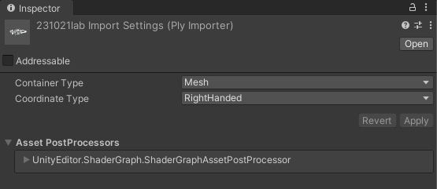

Pcx-RosPointcloud2
===================================

Pcx-RosPointcloud2 is a fork of a Poinc Cloud library called Pcx by Keijiro Takahashi (https://github.com/keijiro/Pcx) for importing  point cloud data which is constructed with right handed coordinate such as pointcloud2 in ROS. 
Use git submodule to include this repo to your Unity project.

Currently, **only static loading is supported**; dynamic loading will be supported in the future(maybe).

System Requirements
-------------------
Unity 2022.3.4f1

Select Coordinate
-----------------


 You can select the coordinate type in the inspector window.


Pcx - Point Cloud Importer/Renderer for Unity
=============================================


**Pcx** is a custom importer and renderer that allows for handling point cloud data
in Unity.

System Requirements
-------------------

- Unity 2019.4

Supported Formats
-----------------

Currently Pcx only supports PLY binary little-endian format.

How To Install
--------------

The Pcx package uses the [scoped registry] feature to import dependent
packages. Please add the following sections to the package manifest file
(`Packages/manifest.json`).

To the `scopedRegistries` section:

```
{
  "name": "Keijiro",
  "url": "https://registry.npmjs.com",
  "scopes": [ "jp.keijiro" ]
}
```

To the `dependencies` section:

```
"jp.keijiro.pcx": "1.0.1"
```

After changes, the manifest file should look like below:

```
{
  "scopedRegistries": [
    {
      "name": "Keijiro",
      "url": "https://registry.npmjs.com",
      "scopes": [ "jp.keijiro" ]
    }
  ],
  "dependencies": {
    "jp.keijiro.pcx": "1.0.1",
    ...
```

[scoped registry]: https://docs.unity3d.com/Manual/upm-scoped.html

Container Types
---------------


There are three types of container for point clouds.

### Mesh

Points are to be contained in a `Mesh` object. They can be rendered with the
standard `MeshRenderer` component. It's recommended to use the custom shaders
included in Pcx (`Point Cloud/Point` and `Point Cloud/Disk`).

### ComputeBuffer

Points are to be contained in a `PointCloudData` object, which uses
`ComputeBuffer` to store point data. It can be rendered with using the
`PointCloudRenderer` component.

### Texture

Points are baked into `Texture2D` objects that can be used as attribute maps
in [Visual Effect Graph].

[Visual Effect Graph]: https://unity.com/visual-effect-graph

Rendering Methods
-----------------

There are two types of rendering methods in Pcx.

### Point (point primitives)

Points are rendered as point primitives when using the `Point Cloud/Point`
shader.


The size of points can be adjusted by changing the material properties.


These size properties are only supported on some platforms; It may work with
OpenGLCore and Metal, but never work with D3D11/12.

This method is also used when the point size is set to zero in
`PointCloudRenderer`.

### Disk (geometry shader)

Points are rendered as small disks when using the `Point Cloud/Disk` shader or
`PointCloudRenderer`.


This method requires geometry shader support.

Acknowledgements
----------------

The point cloud files used in the examples of Pcx are created by authors listed
below. These files are licensed under the Creative Commons Attribution license
([CC BY 4.0]). Please see the following original pages for further details.

- richmond-azaelias.ply - Azaleas, Isabella Plantation, Richmond Park.
  Created by [Thomas Flynn].
  https://sketchfab.com/models/188576acfe89480f90c38d9df9a4b19a

- anthidium-forcipatum.ply - Anthidium forcipatum ♀ (Point Cloud).
  Created by [Thomas Flynn].
  https://sketchfab.com/models/3493da15a8db4f34929fc38d9d0fcb2c

- Guanyin.ply - Guanyin (Avalokitesvara). Created by [Geoffrey Marchal].
  https://sketchfab.com/models/9db9a5dfb6744a5586dfcb96cb8a7dc5

[Thomas Flynn]: https://sketchfab.com/nebulousflynn
[Geoffrey Marchal]: https://sketchfab.com/geoffreymarchal
[CC BY 4.0]: https://creativecommons.org/licenses/by/4.0/
